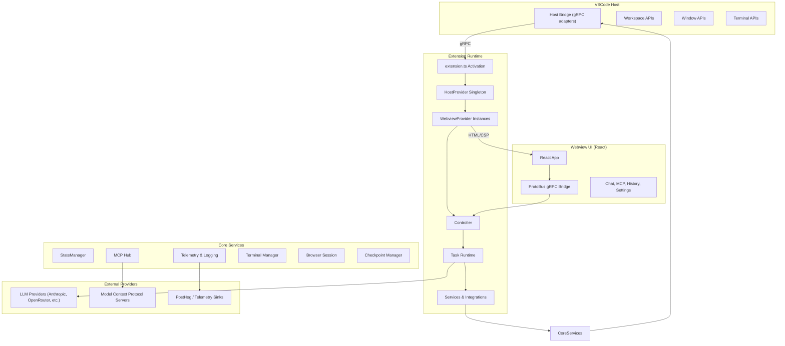
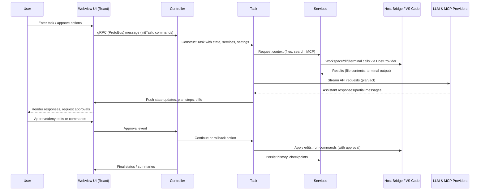
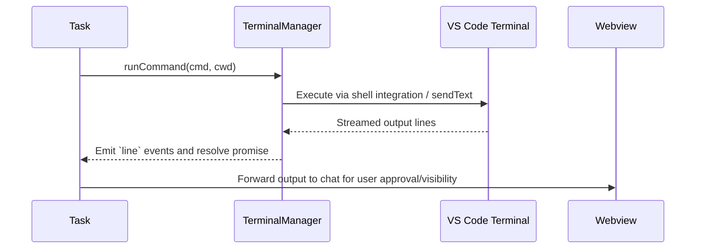
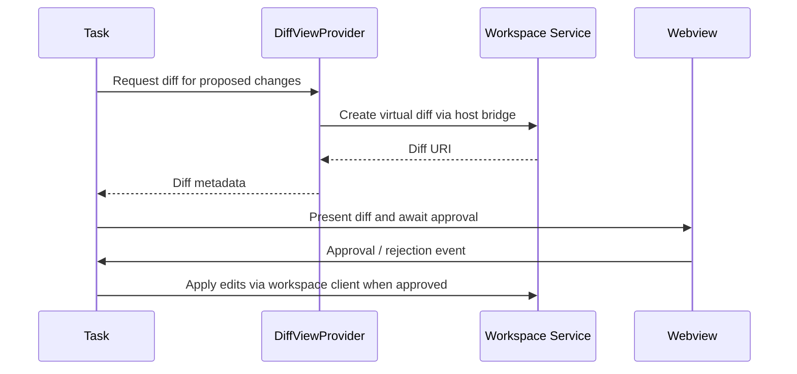

# Cline Architecture and Data Flow

## Layered View

## Component Responsibilities

- **extension.ts** – entry point that wires VS Code activation hooks, registers sidebar/tab webviews, and binds commands to controller actions (`src/extension.ts`).
- **HostProvider** – abstracts host-specific functionality (webview/diff creation, callback URLs, filesystem roots, gRPC clients) so the rest of the codebase stays platform-neutral (`src/hosts/host-provider.ts`).
- **WebviewProvider** – owns individual sidebar/tab instances, creating controllers, serving the React bundle with strict CSP, and tracking active clients (`src/core/webview/WebviewProvider.ts`).
- **Controller** – orchestrates state hydration, auth, MCP hub lifecycle, workspace detection, and mediates between webview messages and the task runtime (`src/core/controller/index.ts`).
- **Task runtime** – coordinates API calls, terminal execution, browser automation, diff generation, checkpoints, and context management during an active task (`src/core/task/index.ts`).
- **Services & integrations** – reusable subsystems for storage, telemetry, auth, globbing, tree-sitter parsing, MCP connections, terminal streaming, etc. (`src/services/**`, `src/integrations/**`).
- **React webview** – renders chat, settings, MCP, history, and account views, exchanging protobuf-encoded messages with the extension via the ProtoBus abstraction (`webview-ui/src/**/*`).

## Data Flow: Task Lifecycle

## Data Flow: Terminal Command Execution

## Data Flow: File Editing

## Storage & State Synchronization

- **StateManager** keeps global settings, task configuration, and secrets in memory with debounced persistence to disk, watching for external edits to keep UI state in sync (`src/core/storage/StateManager.ts`).
- **MCP Hub** watches `mcp.json`, validates schema, spins up transports (stdio/SSE/HTTP), and pushes tool/resource updates to controllers via protobuf events (`src/services/mcp/McpHub.ts`).
- **Telemetry Service** aggregates task events, terminal hangs, feature flags, and sends them to PostHog/Sentry, maintaining lifecycle with the controller (`src/services/telemetry`).

## External Integrations

- **LLM Providers** – Anthropic, OpenRouter-compatible APIs, Gemini, Groq, etc., configured via shared `ApiHandler` factories (`src/core/api`).
- **Model Context Protocol** – dynamically discovered tools and resources exposed inside the chat via the MCP Hub (`src/services/mcp`).
- **Analytics & Logging** – PostHog distinct IDs, telemetry events, and error reporting (`src/services/logging`, `src/services/telemetry`).

## Developer Notes

- Build pipeline uses esbuild for the extension bundle and Vite/React for the webview (`esbuild.mjs`, `webview-ui/vite.config.ts`).
- Protobuf definitions under `proto/` are compiled with Buf/ts-proto into shared TypeScript types consumed by both runtime and UI.
- The architecture is host-agnostic: swapping out the HostProvider enables portable environments (VS Code, standalone harness, tests) without touching controller/task logic.
